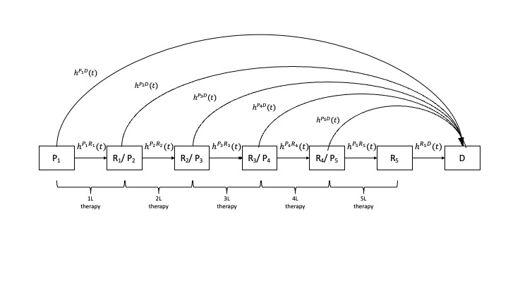

# Overview
This health economic simulation model is designed to estimate the course of disease and expected quality-adjusted life years (QALYs)of multiple myeloma (MM) from a US healthcare perspective with three alternative sequences of treatment regimens for transplant-eligible patients. Model inputs for the number of simulation runs, treatment effects expressed as hazard ratios (HR), and utilities may be entered directly by the user. (Note: Only `R` chunks related to user input are visible in this Rmarkdown file. For a detailed description of the code, we refer the user to the `ModelDescription.Rmd` file. A detailed description of the model will be provided in a technical report.)

----

```{r packgs, echo =FALSE, message=FALSE}
#  knitr::opts_chunk$set(echo = TRUE) make all chunks visible
# Load packages needed ----
library("hesim")
library("data.table")
library("survival")
library("flexsurv")
library("ggplot2")
library("survminer")
library("dplyr")
library("kableExtra")
library("knitr")

theme_set(theme_bw()) # graphics theme_bw = classic dark-on-light ggplot2 theme
rm(list=ls()) # clearing memory space
set.seed(101) # make random number generation reproducible

source("../R/aux_functions.R") # miscellaneous functions
```

# Treatment Sequences

The following treatment sequences are compared with the simulation model:

1.  Sequence 1: (DVRd + ASCT + DR ) \> DKd \> EloPd \> Sd \> Cilta-cel.
2.  Sequence 2: (DVRd + ASCT + DR ) \> Cilta-cel \> TalDara \> Tec \> SKd.
3.  Sequence 3: (DVrd + DRd) \> Tec \> EloPd \> Tal \> Kd.

----

# Model Structure
To estimate the course of disease and expected QALYs with the alternative treatment sequences an individual-level continuous time state transition model is used (Figure \@ref(fig:figMS)).

```{r figMS, fig.cap= "\\label{fig:figMS}Model Structure",  echo=FALSE,  fig.show='hold',fig.align = "center",out.width="700px", fig.pos="H"}
state_ids <- 1:6
transition_names <- c("P1-> R1_P2", "P1 -> Death","R1_P2 -> R2_P3", "R1_P2 -> Death", "R2_P3 -> R3_P4", "R2_P3 -> Death",
                      "R3_P4 -> R4_P5", "R3_P4 -> Death", "R4_P5 -> R5", "R4_P5 -> Death", "R5 -> Death")



```

## Model States

1. P1: On 1L therapy.
2. R1_P2: relapsed on 1L; moved to 2L therapy.
3. R2_P3: relapsed on 2L; moved to 3L therapy.
4. R3_P4: relapsed on 3L; moved to 4L therapy.
5. R4_P5: relapsed on 4L; moved to 5L therapy.
6. R5: relapsed on 5L therapy.
7. Death.

## Transitions

The transitions between the model health states defined above are defined as follows:

1.  t1: $P1 \rightarrow R1\_P2$
2.  t2: $P1 \rightarrow Death$
3.  t3: $R1\_P2 \rightarrow R2\_P3$
4.  t4: $R1\_P2 \rightarrow Death$
5.  t5: $R2\_P3 \rightarrow R3\_P4$
6.  t6: $R2\_P3 \rightarrow Death$
7.  t7: $R3\_P4 \rightarrow R4\_P5$
8.  t8: $R3\_P4 \rightarrow Death$
9.  t9: $R4\_P5 \rightarrow R5$
10. t10: $R3\_P4 \rightarrow Death$
11. t11: $R5 \rightarrow Death$


Time-varying transition rates between states reflecting subsequent treatments are based on progression free survival (PFS) curves from the following studies:  

- Line 1, GRIFFIN [@griffin], 
- Line 2, CANDOR [@candor], 
- Line 3, ELOQUENT-3 [@eloquent3],
- Line 4, STORM [@storm], 
- Line 5, Majes TEC-1 [@majestec].

HR estimates will be applied to obtain time-varying transition rates for the actual treatments of interest by line of treatment for each of the sequences.
Transition rates to death are based on overall survival (OS) data from [@braunlin_21] and US Life Tables.

----

<!---#################################################################################
     #               THIS IS THE BEGINING OF THE INPUT SECTION                       #
     ################################################################################# --->


# Model Inputs (User Defined)

The user need to enter values in the code for the number of simulation runs, treatment effects expressed as HRs, and utilities.

## Simulation Runs: Population Size and Number of Model Parameter Input Samples

The model is an individual-level simulation model by which disease progression over time and expected QALYs for the population of interest are obtained by repeatedly simulating individual patients for a given set of model input parameter values. (The number of individuals simulated needs to be sufficiently large to minimize Monte Carlo error (or 1st order uncertainty) and obtain correct model output results for the set of input values). To propagate the uncertainty in model input parameters and reflect this in model output, the model runs repeatedly for different sets of randomly sampled input parameter values. A sufficiently large number of samples is needed to capture the complete uncertainty distributions of the model input parameters.

You are able to set both the size of the simulated population for given model run (with a given set of model input values) as well as the number of sampled sets of model input parameter values. NOTE: Increasing the simulated population size and the number of samples with different sets of input values will increase the time it takes to get model results.

```{r population, echo= TRUE}
# Simulation Runs ----
n_patients <- 1000 # user: population size per set of parameter values
n_samples <- 1000 # user: number of sampled sets of model input parameter values
```


## Discount Rate

<!-- This chunk sets the discount rate for QALYs -->

```{r ecoanalysis, echo=TRUE}
disc <- 0.03       #  user: annual discount rate
```


## Model Input Parameters
### Disease Progression
#### Hazard Ratios

The code below shows how the HRs (for time to progression) are entered based on the believed range of uncertainty.

```{r HRratesJanssen, echo=TRUE}
# Sequence strategies 
## st1 = Sequence 1
## st2 = Sequence 2
## st3 = Sequence 3
## notst3 = Either sequence 1 or 2
## notst2 = Either sequence 1 or 3

###########################################
## HRuser_modify = 0 use default HRs and uncertainty ranges;
## HRuser_modify = 1 enter HRs and uncertainty ranges
HRuser_modify = 1 
if(HRuser_modify ==1){
kol.HR <- list(
  ## t1: "P1-> R1_P2"
  t1.hr = data.frame(low = c(notst3 = .21,  # DVRd + ASCT + DR. May be modified by user
                             st3 = 1        # DVrd + DRd. May be modified by user
                             ), 
                     up = c( notst3 = .95,  # DVRd + ASCT + DR. May be modified by user
                             st3 = 1        # DVrd + DRd. May be modified by user 
                            )),
  ## t3: "R1_P2 -> R2_P3"
  t3.hr = data.frame(low = c(st1 = 1,       # DKd. May be modified by user
                             st2= .66,      # Cilta-cel. May be modified by user
                             st3= 1         # Tec. May be modified by user
                             ),
                     up = c(st1 = 1,        # DKd. May be modified by user
                            st2 = 1.09,      # Cilta-cel. May be modified by user
                            st3 = 1         # Tec. May be modified by user
                            )),
  ## t5: "R2_P3 -> R3_P4"
  t5.hr = data.frame(low = c(notst2 = .96,    # EloPd. May be modified by user
                             st2= .4       # TalDara. May be modified by user
                             ),
                     up = c(notst2 = 1,     # EloPd. May be modified by user
                            st2 = .79       # TalDara. May be modified by user
                            )),
  ## t7: "R3_P4 -> R4_P5"
  t7.hr = data.frame(low = c(st1 = 1,       # Sd. May be modified by user
                             st2= .05,      # Tec. May be modified by user
                             st3= .16       # Tal. May be modified by user
                             ),
                     up = c(st1 = 1,        # Sd. May be modified by user
                            st2 = .11,      # Tec. May be modified by user
                            st3 = 1         # Tal. May be modified by user
                          )),
  ## t9: "R4_P5 -> R5"
  t9.hr = data.frame(low = c(st1 = .35,     # Cilta-cel. May be modified by user
                             st2= 1.51,      # SKd. May be modified by user
                             st3= 1.04       # Kd. May be modified by user
                             ),
                     up = c(st1 = .53,      # Cilta-cel. May be modified by user
                            st2= 2.21,       # SKd. May be modified by user
                            st3= 1.42        # Kd. May be modified by user
                            ))
)
} else{
  # HRuser_modify = 0, default baseline HRs and uncertainty ranges are used
  load('../data/kol.HR.rda') 
}
```


#### Mortality Adjustments

Choose the method to adjust the time to death pre-progression:

- Based on percentage of mortality up to median PFS: `OS_HR=0`.
- Based on percentage of mortality up to median OS: `OS_HR=1`.
- No adjustment: `OS_HR` not in $\{0,1\}$.

Choose source of mortality curves:

- Based on [@braunlin_21]: `OS_Braunlin=1`.
- Based on US Life Tables: `OS_Braunlin=0`.

```{r mortaity_method, echo=TRUE}
OS_HR <- 0
OS_Braunlin <- 1
```


### Utility

<!--- Utilities per sequence (`strateg_id`) and state (`state_id`) are used by the model to estimate QALYs. For each simulation run of the model, utility values are sample from a beta distribution with mean $m$ and standard error $\varepsilon$. The chunk below indicates how the predetermined  utility inputs are loaded into the model to create a object that the `hesim` package used to estimate population QALYs.-->

In the code below, utility input values are entered.

```{r utilities, echo=TRUE}
# There are 6 non death states in the model:
## 1. P1: On 1L therapy.
## 2. R1_P2: relapsed on 1L; moved to 2L therapy.
## 3. R2_P3: relapsed on 2L; moved to 3L therapy.
## 4. R3_P4: relapsed on 3L; moved to 4L therapy.
## 5. R4_P5: relapsed on 4L; moved to 5L therapy.
## 6. R5: relapsed on 5L therapy.

###########################################
## user_modify = 0 use default HRs and uncertainty ranges;
## user_modify = 1 enter HRs and uncertainty ranges
user_modify = 1 
if(user_modify ==1){
  ## Utilities
  util <- vector('list', length = 3)
  # sequence 1
  util[[1]] <- data.table(strategy_id =1,
                          state_id = state_ids,
                          mean = c(P1 = 0.659, # user
                                   R1_P2 = 0.626, # user
                                   R2_P3 = 0.599, # user
                                   R3_P4 = 0.599, # user
                                   R4_P5 = 0.599, # user
                                   R5 = 0.599 # user
                                   ),
                          se = c(P1 = 0.03475, # user
                                 R1_P2 = 0.02900, # user
                                 R2_P3 = 0.01425, # user
                                 R3_P4 = 0.07175, # user
                                 R4_P5 = 0.07175, # user
                                 R5 = 0.07175 # user
                                 )
                          )
  # sequence 2
  util[[2]] <- data.table(strategy_id =2,
                          state_id = state_ids,
                          mean = c(P1 = 0.659, # user
                                   R1_P2 = 0.626, # user
                                   R2_P3 = 0.599, # user
                                   R3_P4 = 0.599, # user
                                   R4_P5 = 0.599, # user
                                   R5 = 0.599 # user
                                   ),
                          se = c(P1 = 0.03475, # user
                                 R1_P2 = 0.02900, # user
                                 R2_P3 = 0.01425, # user
                                 R3_P4 = 0.07175, # user
                                 R4_P5 = 0.07175, # user
                                 R5 = 0.07175 # user
                                 )
                          )
  # sequence 3
  util[[3]] <- data.table(strategy_id =3, 
                          state_id = state_ids,
                          mean = c(P1 = 0.659, # user
                                   R1_P2 = 0.626, # user
                                   R2_P3 = 0.599, # user
                                   R3_P4 = 0.599, # user
                                   R4_P5 = 0.599, # user
                                   R5 = 0.599 # user
                                   ),
                          se = c(P1 = 0.03475, # user
                                 R1_P2 = 0.02900, # user
                                 R2_P3 = 0.01425, # user
                                 R3_P4 = 0.07175, # user
                                 R4_P5 = 0.07175, # user
                                 R5 = 0.07175 # user
                                 )
                          )
  utility_data <- do.call(rbind, util)
  rm(util)
  } else{
    # user_modify = 0, baseline utilities are used
    load('../data/utility_data.rda')
    }
```


## Set Output File Names

-   When knitting an R markdown file (.Rmd), the working directory is the one that contains the markdown file. For example, the working directory of the present markdown is `r getwd()`.
-   Figures and tables with model results are saved in the output directory set by the user.
-   We recommend creating a dedicated output directory.

The following code:
-   creates (if missing) such a dedicated directory with the name `output`. This directory is located (created) within the project root directory `~/JAN56830`, which is one level above the present markdown working directory. The name of the dedicated output directory can be changed by the user
-   sets the names of files where figures and tables will be saved. Names can be modified by the user.

```{r setOutputFileNames, echo = TRUE}
# Names of the dedicated output directory and file names must not have spaces
  
## Default output path. 
outputdir <- 'output' 

## Name of Excel file where output tables for time to progression (TTP)
## and time to death pre-progression are saved
progression_tbl <- 'progressionTbl.xlsx'

## Name of file where curve for PFS is saved
survePFSline1File <- 'pfs1stline.pdf'

## Name of file where curve for OS from second line survival is saved
surveOSline1File <- 'os1stline.pdf'

## Name of file where curve for PFS at second line survival is saved
survePFSline2File <- 'pfs2ndline.pdf'

## Name of file where curve for TTP at second line survival is saved
surveTTPline2File <- 'ttp2ndline.pdf'

## Name of file where curve for OS from second line survival is saved
surveOSline2File <- 'os2ndline.pdf'

## Name of 'pdf' file where the plot for state probabilities is saved 
state_probFile <- 'stprobs.pdf'

## Names of files where charts with economic outputs are saved
qalys_nm <- 'qalys.pdf'

## Name of file where the  summary statistics of economic outputs are saved
qalySummary <- 'ce_sim_output.xlsx'

```


<!---#################################################################################
     #                   THIS IS THE END OF THE INPUT SECTION                        #
     #                   NO USER EDITS AFTER THIS LINE.                              #
     ################################################################################# --->
     
----

<!--- #################      Show Overview Model Input Parameters      ################# --->


# Overview Model Input Parameters

## Hazard Ratios

Table \@ref(tab:HRtbl) displays the HRs (as uncertainty ranges) that will be applied to reference PFS curves.

```{r HRtbl, echo=FALSE}
load("../data/weilph.data.rda") # loads reference survival data
load("../data/nonMM.data.rda") # loads 3 element list with nonMM mortality, mPFS-based adjusted, mOS-based adjustements

mod.fit <- vector( mode = 'list',length = length(transition_names))

if (OS_HR==0){
  mort.adj <- nonMM.fit[[6]]  #based upon pct of mortality up to median PFS
} else if(OS_HR==1){
  mort.adj <- nonMM.fit[[7]]  #based upon pct of mortality up to median OS
} else {
  mort.adj <- c(1,1,1,1,1)    #No adjustment
}

mod.fit <- vector( mode = 'list',length = length(transition_names))  #a list containing the final user-selected survival distributions
if (OS_Braunlin) {  #populate with the user selected pre-fit distributions
  mod.fit <- weilph.fit
} else {
  #Replace all of the overall survival curves with non-MM mortality curves from US LifeTables
  mod.fit[[1]] <- weilph.fit[[1]]
  mod.fit[[2]] <- nonMM.fit[[1]]
  mod.fit[[3]] <- weilph.fit[[3]]
  mod.fit[[4]] <- nonMM.fit[[2]]
  mod.fit[[5]] <- weilph.fit[[5]]
  mod.fit[[6]] <- nonMM.fit[[3]]
  mod.fit[[7]] <- weilph.fit[[7]]
  mod.fit[[8]] <- nonMM.fit[[4]]
  mod.fit[[9]] <- weilph.fit[[9]]
  mod.fit[[10]] <- nonMM.fit[[5]]
  mod.fit[[11]] <- weilph.fit[[11]]  #Transitions from the palliative state are not adjusted by user selected parameters

  mort.adj <- c(1,1,1,1,1) #override user selected adjustment-By Assumption
}

HR.data <- vector( mode = 'list',length = length(transition_names))
names(HR.data) <- paste0('t',1:length(transition_names),'.hr')
HR.data$t1.hr <- rbind(data.frame(low = c(s1 =1), up = c(s1 = 1)),
                         kol.HR$t1.hr)
HR.data$t2.hr <- rbind(data.frame(low = c(s1 =1), up = c(s1 = 1)),
                          (1+(kol.HR$t1.hr-1)*mort.adj[1]))
HR.data$t3.hr <- rbind(data.frame(low = c(s1 = .74), up = c(s1 = 1)),
                         kol.HR$t3.hr)
HR.data$t4.hr <- rbind(data.frame(low = c(s1 =.74), up = c(s1 = 1)),
                         (1+(kol.HR$t3.hr-1)*mort.adj[2]))
HR.data$t5.hr <- rbind(data.frame(low = c(s1 =.59), up = c(s1 = 1.54)),
                         kol.HR$t5.hr)
HR.data$t6.hr <- rbind(data.frame(low = c(s1 =.59), up = c(s1 = 1.54)),
                         (1+(kol.HR$t5.hr-1)*mort.adj[3]))
HR.data$t7.hr <- rbind(data.frame(low = c(s1 =1), up = c(s1 = 1)),
                         kol.HR$t7.hr)
HR.data$t8.hr <- rbind(data.frame(low = c(s1 =1), up = c(s1 = 1)),
                         (1+(kol.HR$t7.hr-1)*mort.adj[4]))
HR.data$t9.hr <- rbind(data.frame(low = c(s1 =.83), up = c(s1 = 1.3)),
                         kol.HR$t9.hr)
HR.data$t10.hr <- rbind(data.frame(low = c(s1 =.83), up = c(s1 = 1.3)),
                         (1+(kol.HR$t9.hr-1)*mort.adj[5]))
#Transitions from the palliative state are not adjusted by user selected parameters
HR.data$t11.hr <- data.frame(low = c(s1= 3,  st1 =1.05, st2=1.05, st3= 1.05), 
                             up  = c(s1= 3,  st1=1.1, st2=1.1, st3= 1.1))

hr_names <- list(t1 = c('notst3', 'st3'), t2 = c('notst3', 'st3'),
                 t3 = paste0('st',1:3), t4 = paste0('st',1:3),
                 t5 = c('notst2', 'st2'), t6 = c('notst2', 'st2'),
                 t7 = paste0('st',1:3), t8 = paste0('st',1:3),
                 t9 = paste0('st',1:3), t10 = paste0('st',1:3),
                 t11 = paste0('st',1:3))
## Assign transition names to HR ranges
hr <- copy(HR.data)
hr <- lapply(1:11, function(k){data.table(hr[[k]][-1,])})
hr <- lapply(1:11, function(k){hr[[k]][, strategy := hr_names[[k]]] })
hr <- lapply(1:11, function(k){hr[[k]][,Transition:= transition_names[k]]})
hr <- do.call(rbind, hr)
temp <-data.table(strategy =c("st1", "st2", "st3", "notst2", "notst3"),
                  Sequence = c("1", "2", "3", "Not 2", "Not 3"))
hr <- left_join(hr, temp, by ="strategy")[, .(Sequence, Transition,  low, up)]
hr <- hr[, Treatment := c(rep(c(notst3 = "DVRd + ASCT + DR",   st3 = "DVrd + DRd"),2),  # Line 1
                          rep(c(st1 = "DKd", st2 = "Cilta-cel", st3= "Tec"),2), # Line 2
                          rep(c(notst2 = "EloPd", st2 ="TalDara"),2),  # Line 3
                          rep(c("Sd", "Tec", "Tal"), 2),   # Line 4
                          rep(c("Cilta-cel", "SKd", "Kd"),2),  # Line 5
                          rep("Paliative",3))] # Line 5+
knitr::kable(hr[, c(1,5,2, 3,4)],
  caption = "Hazard ratio for each treatment",
  digits = 2, 
  booktabs = TRUE, valign = "t"
) %>%
  kableExtra::kable_styling(bootstrap_options = "striped", latex_options = "hold_position" )

rm(temp, transition_names, hr, hr_names) # remove objects that are no longer used
```


\newpage

## Utility

```{r utilInput, echo=FALSE}
state_labels <- data.table(state = c("P1", "R1_P2", "R2_P3", "R3_P4", "R4_P5", "R5", "Death"),
                           state_id = 1:(length(state_ids)+1))
temp <- left_join(utility_data,state_labels, by = 'state_id')
knitr::kable(temp[,.(strategy_id,state_id, state, mean, se )],
             longtable = T,
             booktabs = T, linesep = "",
             caption = "Utility values used in the model",
             align = "lcrrr") %>%
  kableExtra::kable_styling("striped", 
                            full_width =F,
                            latex_options = "hold_position")
rm(temp) 
```

-----

<!--- #################      Create and Run Model in hesim      ################# 

# Model Setup 

The following R chunk defines the model structure for the `hesim` package. -->

```{r mod_structure, echo=FALSE}
# States ----
tmat <- rbind( c(NA,1,NA,NA, NA, NA, 2),
               c(NA, NA, 3, NA, NA, NA , 4),
               c(NA, NA, NA, 5, NA, NA , 6),
               c(NA, NA, NA, NA, 7, NA , 8),
               c(NA, NA, NA, NA, NA, 9 , 10),
               c(NA, NA, NA, NA, NA, NA , 11),
               c(NA, NA, NA, NA, NA, NA , NA)
               )

colnames(tmat) <- rownames(tmat) <- c("P1", "R1_P2", "R2_P3", "R3_P4", "R4_P5","R5", "Death")
# print(tmat)

# Strategies ----
## Seq1: (DVRd + ASCT + DR )  > DKd         > EloPd   > Sd   > Cilta-cel ----
## Seq2: (DVRd + ASCT + DR )  > Cilta-cel  > TalDara > Tec  > SKd ----
## Seq3: (DVrd + DRd)         > Tec         > EloPd   > Tal  > Kd ----

strategies <- data.table(strategy_id = c(1, 2, 3),
                         strategy_name = c("Sequence 1", "Sequence 2", "Sequence 3"))

 ### No population covariates (age, gender, etc) are defined for this project
patients <- data.table(patient_id=1:n_patients)

no_death_states <- ncol(tmat)-1
states <- data.table(state_id = 1:no_death_states,
                     state_name = rownames(tmat)[1:no_death_states]) # Non-death health states
hesim_dat <- hesim_data( strategies = strategies,
                         patients = patients,
                         states = states)
```

<!-- The following chunk assigns labels to the transitions in the model. -->

```{r transitions, echo=FALSE}
# Transitions ----
### Labels for the plots and summary tables.
labs <- get_labels(hesim_dat)
labs$transition_id <- c("P1-> R1_P2" = 1, #t1
                        "P1 -> Death" = 2, #t2
                        "R1_P2 -> R2_P3" = 3, #t3
                        "R1_P2 -> Death" = 4, #t4
                        "R2_P3 -> R3_P4" = 5, #t5
                        "R2_P3 -> Death" = 6, #t6
                        "R3_P4 -> R4_P5" = 7, #t7
                        "R3_P4 -> Death" = 8, #t8
                        "R4_P5 -> R5" = 9, #t9
                        "R4_P5 -> Death" = 10, #t10
                        "R5 -> Death" = 11) #t11
```

<!-- 
# Parameters
## Transitions

<!-- This chunk loads the predetermined reference survival curves -->

```{r survival_input, echo=FALSE}
load("../data/weilph.data.rda")
```

<!-- this chunk creates the parameters for the transition probabilities -->

```{r transitionInputs, echo=FALSE}
library(magrittr)
set.seed(3455) # Make results reproducible
transmod_coef_def <- define_rng({
  for(i in 1:length(labs$transition_id)){
    assign(paste0("t",i),multi_normal_rng(mu = mod.fit[[i]]$res.t[,1], 
                                          Sigma = vcov(mod.fit[[i]]))) 
  }
  list(
    t1_shape = vec_to_dt(t1$shape),
    t1_scale = t1[, -1,] |> (\(x){colnames(x)=c("cons",  "notst3", "st3"); return(x)})() ,
    t2_shape = vec_to_dt(t2$shape),
    t2_scale = t2[, -1,] |> (\(x){colnames(x)=c("cons", "notst3", "st3"); return(x)})() , 
    t3_shape = vec_to_dt(t3$shape),
    t3_scale = t3[, -1,] |> (\(x){colnames(x)=c("cons", "st1", "st2", "st3"); return(x)})() ,
    t4_shape = vec_to_dt(t4$shape),
    t4_scale = t4[, -1,] |> (\(x){colnames(x)=c("cons", "st1", "st2", "st3"); return(x)})() ,
    t5_shape = vec_to_dt(t5$shape),
    t5_scale = t5[, -1,] |> (\(x){colnames(x)=c("cons", "notst2", "st2"); return(x)})() ,
    t6_shape = vec_to_dt(t6$shape),
    t6_scale = t6[, -1,] |> (\(x){colnames(x)=c("cons", "notst2", "st2"); return(x)})() ,
    t7_shape = vec_to_dt(t7$shape),
    t7_scale = t7[, -1,] |> (\(x){colnames(x)=c("cons", "st1", "st2", "st3"); return(x)})() ,
    t8_shape = vec_to_dt(t8$shape),
    t8_scale = t8[, -1,] |> (\(x){colnames(x)=c("cons", "st1", "st2", "st3"); return(x)})() ,
    t9_shape = vec_to_dt(t9$shape),
    t9_scale = t9[, -1,] |> (\(x){colnames(x)=c("cons", "st1", "st2", "st3"); return(x)})() ,
    t10_shape = vec_to_dt(t10$shape),
    t10_scale = t10[, -1,] |> (\(x){colnames(x)=c("cons", "st1", "st2", "st3"); return(x)})() ,
    t11_shape = vec_to_dt(t11$shape),
    t11_scale = t11[, -1,] |> (\(x){colnames(x)=c("cons"); return(x)})()
  )
}, n = n_samples)

transmod_coef <- eval_rng(transmod_coef_def)
```

<!-- This chunks applies the adjustments to survival curves based in the HR defined above. The model will sample survival parameters.-->

<!-- Uniform sampling of HR (not used) -->
<!-- ```{r hrAdjustment, echo=FALSE} -->
<!-- # Adjust scale according to (sampled) hazard ratios from KOLs -->
<!-- ### P1-> R1_P2 -->
<!-- transmod_coef$t1_scale[,`:=`( -->
<!--              cons = cons + log(runif(n_samples,HR.data$t1.hr$low[1], HR.data$t1.hr$up[1])), -->
<!--              notst3 = log(runif(n_samples,HR.data$t1.hr$low[2], HR.data$t1.hr$up[2])), -->
<!--              st3 = log(runif(n_samples,HR.data$t1.hr$low[3], HR.data$t1.hr$up[3])) -->
<!--   )] -->
<!-- ### P1-> Death -->
<!-- transmod_coef$t2_scale[,`:=`(  -->
<!--              cons = cons + log(runif(n_samples,HR.data$t2.hr$low[1], HR.data$t2.hr$up[1])), -->
<!--              notst3 = log(runif(n_samples,HR.data$t2.hr$low[2], HR.data$t2.hr$up[2])), -->
<!--              st3 = log(runif(n_samples,HR.data$t2.hr$low[3], HR.data$t2.hr$up[3])) -->
<!--   )] -->
<!-- ###  R1_P2 -> R2_P3 -->
<!-- transmod_coef$t3_scale[,`:=`(  -->
<!--              cons = cons + log(runif(n_samples,HR.data$t3.hr$low[1], HR.data$t3.hr$up[1])), -->
<!--              st1 = log(runif(n_samples,HR.data$t3.hr$low[2], HR.data$t3.hr$up[2])), -->
<!--              st2 = log(runif(n_samples,HR.data$t3.hr$low[3], HR.data$t3.hr$up[3])), -->
<!--              st3 = log(runif(n_samples,HR.data$t3.hr$low[4], HR.data$t3.hr$up[4])) -->
<!--   )] -->
<!-- ###  R1_P2 -> Death -->
<!-- transmod_coef$t4_scale[,`:=`(  -->
<!--              cons = cons + log(runif(n_samples,HR.data$t4.hr$low[1], HR.data$t4.hr$up[1])), -->
<!--              st1 = log(runif(n_samples,HR.data$t4.hr$low[2], HR.data$t4.hr$up[2])), -->
<!--              st2 = log(runif(n_samples,HR.data$t4.hr$low[3], HR.data$t4.hr$up[3])), -->
<!--              st3 = log(runif(n_samples,HR.data$t4.hr$low[4], HR.data$t4.hr$up[4])) -->
<!--   )] -->
<!-- ### R2_P3 -> R3_P4 -->
<!-- transmod_coef$t5_scale[,`:=`(  -->
<!--              cons = cons + log(runif(n_samples,HR.data$t5.hr$low[1], HR.data$t5.hr$up[1])), -->
<!--              notst2 = log(runif(n_samples,HR.data$t5.hr$low[2], HR.data$t5.hr$up[2])), -->
<!--              st2 = log(runif(n_samples,HR.data$t5.hr$low[3], HR.data$t5.hr$up[3])) -->
<!--   )] -->
<!-- ### R2_P3 -> Death -->
<!-- transmod_coef$t6_scale[ , `:=`(  -->
<!--              cons = cons + log(runif(n_samples,HR.data$t6.hr$low[1], HR.data$t6.hr$up[1])), -->
<!--              notst2 = log(runif(n_samples,HR.data$t6.hr$low[2], HR.data$t6.hr$up[2])), -->
<!--              st2 = log(runif(n_samples,HR.data$t6.hr$low[3], HR.data$t6.hr$up[3])) -->
<!--   )] -->
<!-- ### R3_P4 -> R4_P5 -->
<!-- transmod_coef$t7_scale[, `:=`(  -->
<!--              cons = cons + log(runif(n_samples,HR.data$t7.hr$low[1], HR.data$t7.hr$up[1])),  -->
<!--              st1 = log(runif(n_samples,HR.data$t7.hr$low[2], HR.data$t7.hr$up[2])), -->
<!--              st2 = log(runif(n_samples,HR.data$t7.hr$low[3], HR.data$t7.hr$up[3])), -->
<!--              st3 = log(runif(n_samples,HR.data$t7.hr$low[4], HR.data$t7.hr$up[4])) -->
<!--   )] -->
<!-- ### R3_P4 -> Death -->
<!-- transmod_coef$t8_scale[, `:=`(  -->
<!--              cons = cons + log(runif(n_samples,HR.data$t8.hr$low[1], HR.data$t8.hr$up[1])),   -->
<!--              st1 = log(runif(n_samples,HR.data$t8.hr$low[2], HR.data$t8.hr$up[2])), -->
<!--              st2 = log(runif(n_samples,HR.data$t8.hr$low[3], HR.data$t8.hr$up[3])), -->
<!--              st3 = log(runif(n_samples,HR.data$t8.hr$low[4], HR.data$t8.hr$up[4])) -->
<!--   )] -->
<!-- ### R4_P5 -> R5 -->
<!-- transmod_coef$t9_scale[, `:=`(  -->
<!--             cons = cons + log(runif(n_samples,HR.data$t9.hr$low[1], HR.data$t9.hr$up[1])),     -->
<!--              st1 = log(runif(n_samples,HR.data$t9.hr$low[2], HR.data$t9.hr$up[2])), -->
<!--              st2 = log(runif(n_samples,HR.data$t9.hr$low[3], HR.data$t9.hr$up[3])), -->
<!--              st3 = log(runif(n_samples,HR.data$t9.hr$low[4], HR.data$t9.hr$up[4])) -->
<!--   )] -->
<!-- ### R4_P5 -> Death -->
<!-- transmod_coef$t10_scale[, `:=`(  -->
<!--              cons = cons + log(runif(n_samples,HR.data$t10.hr$low[1], HR.data$t10.hr$up[1])),       -->
<!--              st1 = log(runif(n_samples,HR.data$t10.hr$low[2], HR.data$t10.hr$up[2])), -->
<!--              st2 = log(runif(n_samples,HR.data$t10.hr$low[3], HR.data$t10.hr$up[3])), -->
<!--              st3 = log(runif(n_samples,HR.data$t10.hr$low[4], HR.data$t10.hr$up[4])) -->
<!--   )] -->
<!-- ### R5 -> Death -->
<!-- transmod_coef$t11_scale[, `:=`(  -->
<!--             cons = cons + log(runif(n_samples,HR.data$t11.hr$low[1], HR.data$t11.hr$up[1])),      -->
<!--             st1 = log(runif(n_samples,HR.data$t11.hr$low[2], HR.data$t11.hr$up[2])), -->
<!--             st2 = log(runif(n_samples,HR.data$t11.hr$low[3], HR.data$t11.hr$up[3])), -->
<!--             st3 = log(runif(n_samples,HR.data$t11.hr$low[4], HR.data$t11.hr$up[4])) -->
<!--   )] -->

<!-- rm(weilph.fit, nonMM.fit, mort.adj, mod.fit,  HR.data) -->
<!-- ``` -->

<!-- Normal sampling of log HR -->
```{r hrAdjustment, echo=FALSE}
# Adjust scale according to (sampled) hazard ratios from KOLs
### P1-> R1_P2
transmod_coef$t1_scale[,`:=`(
             cons = cons + rnorm(n_samples, 
                                      mean = .5*log(HR.data$t1.hr$low[1]*HR.data$t1.hr$up[1]),
                                      sd = .5*log(HR.data$t1.hr$up[1]/HR.data$t1.hr$low[1])/qnorm(.975)),
             notst3 = rnorm(n_samples,
                                   mean = .5*log(HR.data$t1.hr$low[2]* HR.data$t1.hr$up[2]),
                                   sd = .5*log(HR.data$t1.hr$up[2]/HR.data$t1.hr$low[2])/qnorm(.975)),
             st3 =  rnorm(n_samples,
                               mean = .5*log(HR.data$t1.hr$low[3]* HR.data$t1.hr$up[3]),
                               sd = .5*log(HR.data$t1.hr$up[3]/HR.data$t1.hr$low[3])/qnorm(.975))
  )]
### P1-> Death
transmod_coef$t2_scale[,`:=`( 
             cons = cons + rnorm(n_samples,
                                      mean = .5*log(HR.data$t2.hr$low[1]*HR.data$t2.hr$up[1]),
                                      sd = .5*log(HR.data$t2.hr$up[1]/HR.data$t2.hr$low[1])/qnorm(.975)),
             notst3 = rnorm(n_samples,
                                 mean = .5*log(HR.data$t2.hr$low[2]*HR.data$t2.hr$up[2]),
                                 sd = .5*log(HR.data$t2.hr$up[2]/HR.data$t2.hr$low[2])/qnorm(.975)),
             st3 =  rnorm(n_samples,
                               mean = .5*log(HR.data$t2.hr$low[3]*HR.data$t2.hr$up[3]),
                               sd = .5*log(HR.data$t2.hr$up[3]/HR.data$t2.hr$low[3])/qnorm(.975))
  )]
###  R1_P2 -> R2_P3
transmod_coef$t3_scale[,`:=`( 
             cons = cons + rnorm(n_samples,
                                      mean = .5*log(HR.data$t3.hr$low[1]* HR.data$t3.hr$up[1]),
                                      sd = .5*log(HR.data$t3.hr$up[1]/HR.data$t3.hr$low[1])/qnorm(.975)),
             st1 = rnorm(n_samples,
                              mean = .5*log(HR.data$t3.hr$low[2]* HR.data$t3.hr$up[2]),
                              sd = .5*log(HR.data$t3.hr$up[2]/HR.data$t3.hr$low[2])/qnorm(.975)),
             st2 =  rnorm(n_samples,
                              mean = .5*log(HR.data$t3.hr$low[3]* HR.data$t3.hr$up[3]),
                              sd = .5*log(HR.data$t3.hr$up[3]/HR.data$t3.hr$low[3])/qnorm(.975)),
             st3 =  rnorm(n_samples,
                              mean = .5*log(HR.data$t3.hr$low[4]* HR.data$t3.hr$up[4]),
                              sd = .5*log(HR.data$t3.hr$up[4]/HR.data$t3.hr$low[4])/qnorm(.975))
  )]
###  R1_P2 -> Death
transmod_coef$t4_scale[,`:=`( 
             cons = cons + rnorm(n_samples,
                                      mean = .5*log(HR.data$t4.hr$low[1]* HR.data$t4.hr$up[1]),
                                      sd = .5*log(HR.data$t4.hr$up[1]/HR.data$t4.hr$low[1])/qnorm(.975)),
             st1 = rnorm(n_samples,
                              mean = .5*log(HR.data$t4.hr$low[2]* HR.data$t4.hr$up[2]),
                              sd = .5*log(HR.data$t4.hr$up[2]/HR.data$t4.hr$low[2])/qnorm(.975)),
             st2 =  rnorm(n_samples,
                              mean = .5*log(HR.data$t4.hr$low[3]* HR.data$t4.hr$up[3]),
                              sd = .5*log(HR.data$t4.hr$up[3]/HR.data$t4.hr$low[3])/qnorm(.975)),
             st3 =  rnorm(n_samples,
                              mean = .5*log(HR.data$t4.hr$low[4]* HR.data$t4.hr$up[4]),
                              sd = .5*log(HR.data$t4.hr$up[4]/HR.data$t4.hr$low[4])/qnorm(.975))
  )]
### R2_P3 -> R3_P4
transmod_coef$t5_scale[,`:=`( 
             cons = cons + rnorm(n_samples,
                                      mean = .5*log(HR.data$t5.hr$low[1]* HR.data$t5.hr$up[1]),
                                      sd = .5*log(HR.data$t5.hr$up[1]/HR.data$t5.hr$low[1])/qnorm(.975)),
             notst2 = rnorm(n_samples,
                                 mean = .5*log(HR.data$t5.hr$low[2]*HR.data$t5.hr$up[2]),
                                 sd = .5*log(HR.data$t5.hr$up[2]/HR.data$t5.hr$low[2])/qnorm(.975)),
             st2 =  rnorm(n_samples,
                                 mean = .5*log(HR.data$t5.hr$low[3]*HR.data$t5.hr$up[3]),
                                 sd = .5*log(HR.data$t5.hr$up[3]/HR.data$t5.hr$low[3])/qnorm(.975))
  )]
### R2_P3 -> Death
transmod_coef$t6_scale[ , `:=`( 
             cons = cons + rnorm(n_samples,
                                      mean = .5*log(HR.data$t6.hr$low[1]* HR.data$t6.hr$up[1]),
                                      sd = .5*log(HR.data$t6.hr$up[1]/HR.data$t6.hr$low[1])/qnorm(.975)),
             notst2 = rnorm(n_samples,
                                 mean = .5*log(HR.data$t6.hr$low[2]*HR.data$t6.hr$up[2]),
                                 sd = .5*log(HR.data$t6.hr$up[2]/HR.data$t6.hr$low[2])/qnorm(.975)),
             st2 =  rnorm(n_samples,
                                 mean = .5*log(HR.data$t6.hr$low[3]*HR.data$t6.hr$up[3]),
                                 sd = .5*log(HR.data$t6.hr$up[3]/HR.data$t6.hr$low[3])/qnorm(.975))
  )]
### R3_P4 -> R4_P5
transmod_coef$t7_scale[, `:=`( 
             cons = cons + rnorm(n_samples,
                                      mean = .5*log(HR.data$t7.hr$low[1]* HR.data$t7.hr$up[1]),
                                      sd = .5*log(HR.data$t7.hr$up[1]/HR.data$t7.hr$low[1])/qnorm(.975)),
             st1 = rnorm(n_samples,
                              mean = .5*log(HR.data$t7.hr$low[2]* HR.data$t7.hr$up[2]),
                              sd = .5*log(HR.data$t7.hr$up[2]/HR.data$t7.hr$low[2])/qnorm(.975)),
             st2 =  rnorm(n_samples,
                              mean = .5*log(HR.data$t7.hr$low[3]* HR.data$t7.hr$up[3]),
                              sd = .5*log(HR.data$t7.hr$up[3]/HR.data$t7.hr$low[3])/qnorm(.975)),
             st3 =  rnorm(n_samples,
                              mean = .5*log(HR.data$t7.hr$low[4]* HR.data$t7.hr$up[4]),
                              sd = .5*log(HR.data$t7.hr$up[4]/HR.data$t7.hr$low[4])/qnorm(.975))
  )]
### R3_P4 -> Death
transmod_coef$t8_scale[, `:=`( 
             cons = cons + rnorm(n_samples,
                                      mean = .5*log(HR.data$t8.hr$low[1]* HR.data$t8.hr$up[1]),
                                      sd = .5*log(HR.data$t8.hr$up[1]/HR.data$t8.hr$low[1])/qnorm(.975)),
             st1 = rnorm(n_samples,
                              mean = .5*log(HR.data$t8.hr$low[2]* HR.data$t8.hr$up[2]),
                              sd = .5*log(HR.data$t8.hr$up[2]/HR.data$t8.hr$low[2])/qnorm(.975)),
             st2 =  rnorm(n_samples,
                              mean = .5*log(HR.data$t8.hr$low[3]* HR.data$t8.hr$up[3]),
                              sd = .5*log(HR.data$t8.hr$up[3]/HR.data$t8.hr$low[3])/qnorm(.975)),
             st3 =  rnorm(n_samples,
                              mean = .5*log(HR.data$t8.hr$low[4]* HR.data$t8.hr$up[4]),
                              sd = .5*log(HR.data$t8.hr$up[4]/HR.data$t8.hr$low[4])/qnorm(.975))
  )]
### R4_P5 -> R5
transmod_coef$t9_scale[, `:=`( 
            cons = cons + rnorm(n_samples,
                                      mean = .5*log(HR.data$t9.hr$low[1]* HR.data$t9.hr$up[1]),
                                      sd = .5*log(HR.data$t9.hr$up[1]/HR.data$t9.hr$low[1])/qnorm(.975)),
             st1 = rnorm(n_samples,
                              mean = .5*log(HR.data$t9.hr$low[2]* HR.data$t9.hr$up[2]),
                              sd = .5*log(HR.data$t9.hr$up[2]/HR.data$t9.hr$low[2])/qnorm(.975)),
             st2 =  rnorm(n_samples,
                              mean = .5*log(HR.data$t9.hr$low[3]* HR.data$t9.hr$up[3]),
                              sd = .5*log(HR.data$t9.hr$up[3]/HR.data$t9.hr$low[3])/qnorm(.975)),
             st3 =  rnorm(n_samples,
                              mean = .5*log(HR.data$t9.hr$low[4]* HR.data$t9.hr$up[4]),
                              sd = .5*log(HR.data$t9.hr$up[4]/HR.data$t9.hr$low[4])/qnorm(.975))
  )]
### R4_P5 -> Death
transmod_coef$t10_scale[, `:=`( 
             cons = cons + rnorm(n_samples,
                                      mean = .5*log(HR.data$t10.hr$low[1]* HR.data$t10.hr$up[1]),
                                      sd = .5*log(HR.data$t10.hr$up[1]/HR.data$t10.hr$low[1])/qnorm(.975)),
             st1 = rnorm(n_samples,
                              mean = .5*log(HR.data$t10.hr$low[2]* HR.data$t10.hr$up[2]),
                              sd = .5*log(HR.data$t10.hr$up[2]/HR.data$t10.hr$low[2])/qnorm(.975)),
             st2 =  rnorm(n_samples,
                              mean = .5*log(HR.data$t10.hr$low[3]* HR.data$t10.hr$up[3]),
                              sd = .5*log(HR.data$t10.hr$up[3]/HR.data$t10.hr$low[3])/qnorm(.975)),
             st3 =  rnorm(n_samples,
                              mean = .5*log(HR.data$t10.hr$low[4]* HR.data$t10.hr$up[4]),
                              sd = .5*log(HR.data$t10.hr$up[4]/HR.data$t10.hr$low[4])/qnorm(.975))
  )]
### R5 -> Death
transmod_coef$t11_scale[, `:=`( 
            cons = cons + rnorm(n_samples,
                                      mean = .5*log(HR.data$t11.hr$low[1]* HR.data$t11.hr$up[1]),
                                      sd = .5*log(HR.data$t11.hr$up[1]/HR.data$t11.hr$low[1])/qnorm(.975)),
             st1 = rnorm(n_samples,
                              mean = .5*log(HR.data$t11.hr$low[2]* HR.data$t11.hr$up[2]),
                              sd = .5*log(HR.data$t11.hr$up[2]/HR.data$t11.hr$low[2])/qnorm(.975)),
             st2 =  rnorm(n_samples,
                              mean = .5*log(HR.data$t11.hr$low[3]* HR.data$t11.hr$up[3]),
                              sd = .5*log(HR.data$t11.hr$up[3]/HR.data$t11.hr$low[3])/qnorm(.975)),
             st3 =  rnorm(n_samples,
                              mean = .5*log(HR.data$t11.hr$low[4]* HR.data$t11.hr$up[4]),
                              sd = .5*log(HR.data$t11.hr$up[4]/HR.data$t11.hr$low[4])/qnorm(.975))
  )]

#rm(weilph.fit, nonMM.fit, mort.adj, mod.fit,  HR.data)

```

<!-- The following chunk defines the (sampled) survival parameters for each transition in the model used by the `hesim` package.-->

```{r trans_params_coef, echo=FALSE}
transmod_params <- params_surv_list(
  # 1. P1-> R1_P2
  params_surv(coefs = list(shape = transmod_coef$t1_shape,
                           scale = transmod_coef$t1_scale), 
              dist = "weibullPH"),
  # 2. P1 -> Death
  params_surv(coefs = list(shape = transmod_coef$t2_shape,
                           scale = transmod_coef$t2_scale), 
              dist = "weibullPH"),
  # 3. R1_P2 -> R2_P3
  params_surv(coefs = list(shape = transmod_coef$t3_shape,
                           scale = transmod_coef$t3_scale), 
              dist = "weibullPH"),
  # 4. R1_P2 -> Death
  params_surv(coefs = list(shape = transmod_coef$t4_shape,
                           scale = transmod_coef$t4_scale), 
              dist = "weibullPH"),
  # 5. R2_P3 -> R3_P4
  params_surv(coefs = list(shape = transmod_coef$t5_shape,
                           scale = transmod_coef$t5_scale), 
              dist = "weibullPH"),
  # 6. R2_P3 -> Death
  params_surv(coefs = list(shape = transmod_coef$t6_shape,
                           scale = transmod_coef$t6_scale), 
              dist = "weibullPH"),
  # 7. R3_P4 -> R4_P5
  params_surv(coefs = list(shape = transmod_coef$t7_shape,
                           scale = transmod_coef$t7_scale), 
              dist = "weibullPH"),
  # 8 R3_P4 -> Death
  params_surv(coefs = list(shape = transmod_coef$t8_shape,
                           scale = transmod_coef$t8_scale),
              dist = "weibullPH"),
  # 9. R4_P5 -> R5
  params_surv(coefs = list(shape = transmod_coef$t9_shape,
                           scale = transmod_coef$t9_scale),
              dist = "weibullPH"),
  # 10. R4_P5 -> Death
  params_surv(coefs = list(shape = transmod_coef$t10_shape,
                           scale = transmod_coef$t10_scale),
              dist = "weibullPH"),
  # 11. R5 -> Death
  params_surv(coefs = list(shape = transmod_coef$t11_shape,
                           scale = transmod_coef$t11_scale),
              dist = "weibullPH")
)
```

<!-- 
## Utility -->

```{r utility_cost_tables, echo=FALSE}

utility_tbl <- stateval_tbl(utility_data, dist = "beta")
```

<!-- 
# Simulation
## Constructing the Model

### Disease Model
 
The next lines of code create the individual-level continuous time state transition model. It uses the transition parameters (`transmod_paras`), the population data along with the strategies (`transmod_data`) and the matrix of valid transitions within the model (`tmat`)-->

```{r transition_model, echo=FALSE}
transmod_data <- expand(hesim_dat, by = c("strategies", "patients"))

transmod_data[, cons := 1]  ## constant term created by transmod
transmod_data[, st1:= ifelse(strategy_name == "Sequence 1",1,0) ]
transmod_data[, st2:= ifelse(strategy_name == "Sequence 2",1,0) ]
transmod_data[, st3:= ifelse(strategy_name == "Sequence 3",1,0) ]
transmod_data[, notst3:= ifelse(strategy_name != "Sequence 3",1,0)]
transmod_data[, notst2:= ifelse(strategy_name != "Sequence 2",1,0)]


# Transition model ----
transmod <- create_IndivCtstmTrans(transmod_params, 
                                   input_data = transmod_data,
                                   trans_mat = tmat,
                                   clock = "reset")
```

<!-- 
### Utility Model
The chunk below creates the utility model -->

```{r utilmod, echo=FALSE}
utilitymod <- create_StateVals(utility_tbl, n = n_samples, hesim_data = hesim_dat)
```

<!--
### Combining the Models
The complete model (without costs) is constructed by combining the disease and utility. -->

```{r econmod, echo=FALSE}
econmod <- IndivCtstm$new(trans_model = transmod,
                          utility_model = utilitymod
)
```

<!--- 
## Simulating Outcomes
### Disease Progression

The next chunk runs the disease progression model --->

```{r disprog, echo=FALSE}
# Simulation ----
econmod$sim_disease()
```

<!---
### QALYs

A discount factor $v=(1+r)^{-1}$, $0\leq r<1$, is used in the model to estimate total discounted QALYs, medical and treatment costs. The following chunk defines the discount rate and factors. -->

```{r discFactor, echo=FALSE}
v <- 1/(1+disc) # discount factor for QALYs

```

<!--- The next chunk performs the estimation of expected QALYs --> 

```{r qalysim, echo=FALSE}
# QALYs model ----
econmod$sim_qalys(dr = disc)
```

<!--- ##############  Display and Save Model Output  ##################--->

# Model Output

```{r outputPath, echo=FALSE}
## Dedicated output directory
outputdir <- paste0("../", outputdir) 
 if(!dir.exists(outputdir)){
  dir.create(outputdir)
 }
```

## Course of Disease

### State Probabilities

<!-- The time evolution of state probabilities (probability that on individual is in any given state at any point in time) are also useful to evaluate the performance of the different sequence strategies. The chunk below creates a group of graphs showing the state probabilities (see Figure  @ref(fig:figSP)).-->

```{r figSP, fig.align='center', fig.cap="\\label{fig:figSP}State Probabilities for Each Line of Treatment per Sequence", fig.pos='H', echo=FALSE, warning=FALSE, fig.dim = c(6, 8) }

 ## Plot of state probabilities ----
econmod$sim_stateprobs(t = seq(0, 30, .5)) 
summarize_stprobs <- function(stateprobs){
  x <- stateprobs[, .(prob_mean = mean(prob), 
                      low_prob_2.5 = quantile(prob, .025),
                      up_prob_2.5 = quantile(prob, .975)),
                  by = c("strategy_id", "state_id", "t")]
  set_labels(x, labels = labs, new_names = c("strategy_name", "state_name"))
}

stprobs <- summarize_stprobs(econmod$stateprobs_)
ggplot(stprobs, aes(x = t, y = prob_mean, col = strategy_name)) +
  geom_line() +  
  geom_ribbon(aes(ymin = low_prob_2.5, ymax = up_prob_2.5, fill = strategy_name), alpha = 0.2, linetype=0) +
  facet_wrap(~state_name,ncol = 2) + 
  xlab("Years") + ylab("Probability in Health State") +
  # scale_color_discrete(name = "Strategy") +
  theme(legend.position = "bottom", 
        legend.title = element_blank())
```

-   This plot is saved to `r file.path(outputdir, state_probFile)`.

```{r state_probs, echo=FALSE}
## save the state probability plots into the dedicated output directory
ggsave(file.path(outputdir, state_probFile), width = 10, height = 15, units = "cm")

## remove objects that are no longer needed
rm(state_probFile)

```

\newpage

<!-- # TTP, TTDP, PSF and OS summary tables -->
<!-- The next chunks use the output of the simulation model to create tables with summary statistics of the time spent in each state.-->

```{r time_spent, echo=FALSE}
econmod$disprog_[, `:=`(transition = paste0(from,'_',to), time_spent= time_stop - time_start), ]
# Some useful summary tables ----
disprog <- copy(econmod$disprog_)

disprog <- disprog[,.( progressed = .N,
  mean_time_spent = mean(time_spent), 
  median_time_spent = median(time_spent)
  ),
  by = .(sample, strategy_id, transition, from, to,final)]

##  Time to progression summary ----
summary_dis <- disprog[,.( mean_progressed = mean(progressed),
                           mean_time_spent = mean(mean_time_spent), 
                           med_time_spent = mean(median_time_spent),
                           time_spent05 = quantile(mean_time_spent,.05), 
                           time_spent95 = quantile(mean_time_spent,.95)), 
                       .(strategy_id, from, to, transition)
                       ][order(strategy_id, transition)]
per_line <- summary_dis[, .(mean_entry = sum(mean_progressed)), by = .(strategy_id,from)]

summary_dis <- left_join(summary_dis,per_line,by = c("strategy_id","from"))

summary_dis <- summary_dis[,.(strategy_id, from, mean_entry, to, mean_progressed,  
                              med_time_spent, mean_time_spent, time_spent05, time_spent95)]
summary_dis[, `:=`(proportion= ifelse(mean_entry==0,"-", round(mean_progressed/mean_entry,2)),
                   init_prop = round(mean_entry/n_patients,2))
            ]
names(summary_dis) <- c("Strategy", "from", "Entered",
                         "to", "Exited",  "Median", "Mean",
                         "Low 5%", "Top 5%", "Proportion", "% of initial pop")
summary_dis <- summary_dis[, `:=`(`From Line` = ifelse(from == 6, "5+", from),
                                  `To Line` = ifelse(to == 7, "D", ifelse(to == 6, "5+",to)),
                                  `Median Duration` = round(Median,2),
                                  `Mean Duration` = round(Mean,2),
                                  `95% - CI` = paste0("(",round(`Low 5%`,2),", ",
                                  round(`Top 5%`,2), ")")
                                  )]
summary_dis[, Transition := paste(`From Line`,'to', `To Line`)]
summary_dis <- summary_dis[,.(Strategy, `From Line`, `To Line`,
                              Transition, Proportion, `% of initial pop`,
                              `Median Duration`, `Mean Duration`,
                              `95% - CI`)]

rm(disprog) # remove object not needed anymore
```

### Time to Progression
<!-- The chunk below creates a table (see Table @ref(tab:summaryProg)) with summary statistics of the time to progression (TTP). -->

```{r summaryProg, echo=FALSE}
## Progression and survival per line of treatment summary ----
tbl_summaryP <- summary_dis[`To Line`!= "D", .(
  Strategy, `% of initial pop`,
  Transition, `Proportion`,
  `Median Duration`, `Mean Duration`, 
  `95% - CI`)]
names(tbl_summaryP)[c(4,5,6)] <- c("% who progressed", "Median TTP", "Mean TTP")
 
knitr::kable(tbl_summaryP,
  longtable = T,
  booktabs = T, 
  caption = "Time to Progression (TTP) per Line of Treatment",
  align = "lcrrrr") %>%
  kableExtra::kable_styling('striped', latex_options = "hold_position")
```


<!-- A comparison of time to progression at second line of treatment is done to evaluate the performance of the different sequence strategies. The chunk bellow creates a graph (see Figure   @ref(fig:figTTPl2)) displaying the PFS for  individuals who progressed to second line and progressed to third line.-->

```{r figTTPl2,  fig.align='center', fig.cap="\\label{fig:figTTPl2}Time to Progression at Second Line", fig.pos='H', echo=FALSE, warning=FALSE}
# Time to Progression at Second Line
pfsl2.data <- econmod$disprog_[from ==2 & final==0,] 
pfs_data <- lapply(seq(0,30, by =.5), 
                    function(x){data.table(t=x,pfsl2.data[,.(prob = mean(time_spent>x)),
                                                          by =.(sample,strategy_id)])})
pfs_data <- do.call(rbind, pfs_data)
pfs_data <- pfs_data[, .(prob_mean = mean(prob),
                         ci_l = quantile(prob, .025),
                         ci_u = quantile(prob, .975)),
                     by = .(t,strategy_id)]
setorder(pfs_data, strategy_id, t)
set_labels(pfs_data, labels = labs, new_names = c("strategy_name"))
ggplot(pfs_data, aes(x = t, y = prob_mean, col = strategy_name)) +
  geom_line() +  ylim(0,1) +
  geom_ribbon(aes(ymin = ci_l, ymax = ci_u, fill = strategy_name), alpha = .2, linetype=0) +
  xlab("Years") + ylab("TTP at Second Line") +
  #ggtitle("Time to Progression at Second Line") +
  theme(legend.position = "bottom",
        legend.title = element_blank(),
        plot.title = element_text(hjust = 0.5))

```

-   This figure is saved to `r file.path(outputdir, surveTTPline2File)`.

```{r plotTTPl2, echo=FALSE}
## Save plot in the dedicated output directory
ggsave(file.path(outputdir, surveTTPline2File), width = 20, height = 15, units = "cm")

# remove object which will be no longer used
rm(surveTTPline2File, pfsl2.data, pfs_data) # remove objects that are no longer used
```


### Time to Death Pre-Progression
<!-- The next chunk creates a table (see Table @ref(tab:summaryDeath)) with summary statistics of the time to death pre-transition. -->

```{r summaryDeath, echo=FALSE, message=FALSE}
# progression to death summary
tbl_summaryD <- summary_dis[`To Line`== "D", .(
  Strategy, `% of initial pop`,
  Transition, `Proportion`,
  `Median Duration`, `Mean Duration`, 
  `95% - CI`)]
names(tbl_summaryD)[c(4,5,6)] <- c("% who died", "Median TTDP", "Mean TTDP")

knitr::kable(tbl_summaryD,
  longtable = T,
  booktabs = T,
  linesep = linesep(c(6,6,6)),
  caption = "Time to death pre-pregression (TTDP) per line of treatment",
  align = "lcrrrr") %>%
  kableExtra::kable_styling('striped', latex_options = "hold_position")

rm(summary_dis) # remove objects that are no longer needed
```

### Progression Free Survival

<!--- The next chunk creates a table (see Table @ref(tab:summaryPFS)) with summary statistics of progression free survival (PFS), that is time to progression or death pre-progression. --->

```{r summaryPFS, echo=FALSE, message=FALSE}
summary_dis <- econmod$disprog_[,.( mean_time_spent = mean(time_spent), 
                                median_time_spent = median(time_spent)
                                ),
                            by = .(sample, strategy_id, from)]

##  Time to progression summary ----
summary_dis <- summary_dis[,.(med_time_spent = mean(median_time_spent),
                          mean_time_spent = mean(mean_time_spent), 
                          time_spent05 = quantile(mean_time_spent,.05), 
                          time_spent95 = quantile(mean_time_spent,.95)), 
                       .(strategy_id, from)
                       ][order(strategy_id)]
per_line[,prop_init := mean_entry/n_patients]
summary_dis <- left_join(summary_dis, per_line[,.(strategy_id, from, prop_init)],
                         by = c('strategy_id', 'from'))
names(summary_dis) <- c("Strategy", "LOT",
                          "Median", "Mean",
                         "Low 5%", "Top 5%", "% of initial pop")
summary_dis <- summary_dis[, `:=`(`LOT` = ifelse(LOT == 6, "5+", LOT),
                                  `Median PFS` = round(Median,2),
                                  `Mean PFS` = round(Mean,2),
                                  `95% - CI` = paste0("(",round(`Low 5%`,2),", ",
                                  round(`Top 5%`,2), ")")
                                  )]

# PFS tbl
tbl_summaryPFS <- summary_dis[, .(Strategy, `% of initial pop`, LOT,
            `Median PFS`, `Mean PFS`, 
            `95% - CI`)]
tbl_summaryPFS$`% of initial pop` <- round(tbl_summaryPFS$`% of initial pop`,2)

knitr::kable(tbl_summaryPFS,
  longtable = T,
  booktabs = T,
  linesep = linesep(c(6,6,6)),
  caption = "Progression free survival (PFS) per line of treatment",
  align = "rrrrr") %>%
  kableExtra::kable_styling('striped', latex_options = "hold_position")

 rm(summary_dis)
```


<!-- A comparison of progression free survival (PFS) is done to evaluate the performance of the different sequence strategies. The chunk bellow creates a graph (see Figure   @ref(fig:figPFSl1)) displaying PFS. -->


```{r figPFSl1,  fig.align='center', fig.cap="\\label{fig:figPFSl1}Progression Free Survival from Start of First Line Treatment", fig.pos='H', echo=FALSE, warning=FALSE}
#Progression Free Survival from Start of First Line Treatment
pfsl1.data <- econmod$disprog_[from ==1,] 
pfs_data <- lapply(seq(0,40, by =.5), 
                    function(x){data.table(t=x,pfsl1.data[,.(prob = mean(time_spent>x)),
                                                          by =.(sample,strategy_id)])})
pfs_data <- do.call(rbind, pfs_data)
pfs_data <- pfs_data[, .(prob_mean = mean(prob),
                         ci_l = quantile(prob, .025),
                         ci_u = quantile(prob, .975)),
                     by = .(t,strategy_id)]
setorder(pfs_data, strategy_id, t)
set_labels(pfs_data, labels = labs, new_names = c("strategy_name"))
ggplot(pfs_data, aes(x = t, y = prob_mean, col = strategy_name)) +
  geom_line() +  ylim(0,1) +
  geom_ribbon(aes(ymin = ci_l, ymax = ci_u, fill = strategy_name), alpha = .2, linetype=0) +
  xlab("Years") + ylab("PFS from Start of First Line Treatment") +
  #ggtitle("Progression Free Survival from Start of First Line Treatment") +
  theme(legend.position = "bottom",
        legend.title = element_blank(),
        plot.title = element_text(hjust = 0.5))

```

-   This figure is saved to `r file.path(outputdir, survePFSline1File)`.

```{r plotPFSl1, echo=FALSE}
## Save plot in the dedicated output directory
ggsave(file.path(outputdir, survePFSline1File), width = 20, height = 15, units = "cm")

# remove object which will be no longer used
rm(survePFSline1File, pfsl1.data, pfs_data) # remove objects that are no longer used
```


<!-- A comparison of PFS  at second line of treatment is done to evaluate the performance of the different sequence strategies. The chunk bellow creates a graph (see Figure   @ref(fig:figPFSl2)) displaying the PFS for  individuals who progressed to second line. -->


```{r figPFSl2,  fig.align='center', fig.cap="\\label{fig:figPFSl2}Progression Free Survival at Second Line", fig.pos='H', echo=FALSE, warning=FALSE}
# Progression Free Survival at Second Line
pfsl2.data <- econmod$disprog_[from ==2,] 
pfs_data <- lapply(seq(0,30, by =.5), 
                    function(x){data.table(t=x,pfsl2.data[,.(prob = mean(time_spent>x)),
                                                          by =.(sample,strategy_id)])})
pfs_data <- do.call(rbind, pfs_data)
pfs_data <- pfs_data[, .(prob_mean = mean(prob),
                         ci_l = quantile(prob, .025),
                         ci_u = quantile(prob, .975)),
                     by = .(t,strategy_id)]
setorder(pfs_data, strategy_id, t)
set_labels(pfs_data, labels = labs, new_names = c("strategy_name"))
ggplot(pfs_data, aes(x = t, y = prob_mean, col = strategy_name)) +
  geom_line() +  ylim(0,1) +
  geom_ribbon(aes(ymin = ci_l, ymax = ci_u, fill = strategy_name), alpha = .2, linetype=0) +
  xlab("Years") + ylab("PFS at Second Line") +
  #ggtitle("Progression Free Survival at Second Line") +
  theme(legend.position = "bottom",
        legend.title = element_blank(),
        plot.title = element_text(hjust = 0.5))

```

-   This figure is saved to `r file.path(outputdir, survePFSline2File)`.

```{r plotPFS2l, echo=FALSE}
## Save plot in the dedicated output directory
ggsave(file.path(outputdir, survePFSline2File), width = 20, height = 15, units = "cm")

# remove object which will be no longer used
rm(survePFSline2File, pfsl2.data, pfs_data) # remove objects that are no longer used
```


### Overall Survival

<!--- The next chunk creates a table (see Table @ref(tab:summaryOS)) with summary statistics of OS from each line of treatment. --->

```{r summaryOS, echo=FALSE}
summary_dis <- lapply(1:6, function(k){econmod$disprog_[from >= k, .(TTD = sum(time_spent)),
                                               by = .(sample, strategy_id, patient_id)]})
summary_dis <- lapply(1:6, function(k){ summary_dis[[k]][, from := k]})
summary_dis <- do.call(rbind, summary_dis)

summary_dis <- summary_dis[, .(OSmean = mean(TTD), OSmedian = median(TTD) ),
         by = .(sample, strategy_id, from)]
summary_dis <- summary_dis[,.(medianOS = mean(OSmedian),
                              meanOS = mean(OSmean),
                              low = quantile(OSmean, .025),
                              up = quantile(OSmean, .975)),
                           by = .(strategy_id, from)]
summary_dis <- summary_dis[order(strategy_id, from)]
summary_dis <- left_join(summary_dis, per_line[,.(strategy_id, from, prop_init)],
                         by = c('strategy_id', 'from'))
names(summary_dis) <- c("Strategy", "LOT",
                          "Median", "Mean",
                         "Low 5%", "Top 5%", "% of initial pop")
summary_dis <- summary_dis[, `:=`(`LOT` = ifelse(LOT == 6, "5+", LOT),
                                  `Median OS` = round(Median,2),
                                  `Mean OS` = round(Mean,2),
                                  `95% - CI` = paste0("(",round(`Low 5%`,2),", ",
                                  round(`Top 5%`,2), ")")
                                  )]

# OS tbl
tbl_summaryOS <- summary_dis[, .(Strategy, `% of initial pop`, LOT,
            `Median OS`, `Mean OS`, 
            `95% - CI`)]
tbl_summaryOS$`% of initial pop` <- round(tbl_summaryOS$`% of initial pop`,2)

knitr::kable(tbl_summaryOS,
  longtable = T,
  booktabs = T,
  linesep = linesep(c(6,6,6)),
  caption = "Overall survival from line of treatment",
  align = "rrrrr") %>%
  kableExtra::kable_styling('striped', latex_options = "hold_position")

 rm(summary_dis, per_line)
```

\newpage

-   Summary tables with statistics on sojourn time between states (non-death and to death state) are saved to `r file.path(outputdir, progression_tbl)`.

```{r probsummaryTBLS, echo=FALSE}
progressionlist <- list(TTP=tbl_summaryP, TTDP= tbl_summaryD, PFS = tbl_summaryPFS, OS = tbl_summaryOS)

## Save tbl_summaryP and tbl_summaryD to excel files in the dedicated output directory
writexl::write_xlsx(progressionlist, path = file.path(outputdir, progression_tbl))
# WriteXLS::WriteXLS(progressionlist, ExcelFileName = file.path(outputdir, progression_tbl))

# remove objects that will no longer be used
rm(tbl_summaryD, tbl_summaryP, tbl_summaryPFS, tbl_summaryOS, progressionlist, progression_tbl)
```


```{r figOSl1,  fig.align='center', fig.cap="\\label{fig:figOSl1}Overall Survival from Start of First Line Treatment", fig.pos='H', echo=FALSE, warning=FALSE}
# Overall Survival from Start of First Line Treatment
osl1.data <- econmod$disprog_[, .(OS = sum(time_spent)), 
                              by = .(sample, strategy_id, patient_id)]
prob_data <- lapply(seq(0,40, by =.5), 
                    function(x){data.table(t=x,osl1.data[,.(prob = mean(OS>x)),
                                                         by =.(sample,strategy_id)])})
prob_data <- do.call(rbind, prob_data)
prob_data <- prob_data[, .(prob_mean = mean(prob),
                           ci_l = quantile(prob, .025),
                           ci_u = quantile(prob, .975)),
                       by = .(t,strategy_id)]
setorder(prob_data, strategy_id, t)
set_labels(prob_data, labels = labs, new_names = c("strategy_name"))
ggplot(prob_data, aes(x = t, y = prob_mean, col = strategy_name)) +
  geom_line() +  ylim(0,1) +
  geom_ribbon(aes(ymin = ci_l, ymax = ci_u, fill = strategy_name), alpha = .1, linetype=0) +
  xlab("Years") + ylab("OS from Start of First Line Treatment") +
  #ggtitle("Overall Survival from Start of First Line Treatment") +
  theme(legend.position = "bottom",
        legend.title = element_blank(),
        plot.title = element_text(hjust = 0.5))
```

-   This plot is saved to `r file.path(outputdir, surveOSline1File)`.

```{r plotSurvl1, echo=FALSE}
## Save plot in the dedicated output directory
ggsave(file.path(outputdir, surveOSline1File), width = 20, height = 15, units = "cm")

# remove object which will be no longer used
rm(surveOSline1File,  osl1.data, prob_data)
```


```{r figOSl2,  fig.align='center', fig.cap="\\label{fig:figOSl2}Overall Survival from Second Line", fig.pos='H', echo=FALSE, warning=FALSE}
# Overall Survival from Second Line
osl2.data <- econmod$disprog_[from!=1, .(OS = sum(time_spent)), 
                              by = .(sample, strategy_id, patient_id)]
prob_data <- lapply(seq(0,30, by =.5), 
                    function(x){data.table(t=x,osl2.data[,.(prob = mean(OS>x)),
                                                         by =.(sample,strategy_id)])})
prob_data <- do.call(rbind, prob_data)
prob_data <- prob_data[, .(prob_mean = mean(prob),
                           ci_l = quantile(prob, .025),
                           ci_u = quantile(prob, .975)),
                       by = .(t,strategy_id)]
setorder(prob_data, strategy_id, t)
set_labels(prob_data, labels = labs, new_names = c("strategy_name"))
ggplot(prob_data, aes(x = t, y = prob_mean, col = strategy_name)) +
  geom_line() +  ylim(0,1) +
  geom_ribbon(aes(ymin = ci_l, ymax = ci_u, fill = strategy_name), alpha = .1, linetype=0) +
  xlab("Years") + ylab("OS from Second Line") +
  #ggtitle("Overall Survival from Second Line") +
  theme(legend.position = "bottom",
        legend.title = element_blank(),
        plot.title = element_text(hjust = 0.5))
```

-   This plot is saved to `r file.path(outputdir, surveOSline2File)`.

```{r plotSurv2l, echo=FALSE}
## Save plot in the dedicated output directory
ggsave(file.path(outputdir, surveOSline2File), width = 20, height = 15, units = "cm")

# remove object which will be no longer used
rm(surveOSline2File,  osl2.data, prob_data)
```


\newpage

## QALYs

The model creates charts that break down expected QALYs by treatment sequence and line of treatment. These charts are saved to file

* QALY summary: `r file.path(outputdir, qalys_nm)`.


<!-- The next chunk creates a chart of expected QALYs for each strategy sequence (see Figure   @ref(fig:fig4)) broken down by LOT-->

```{r fig4, fig.align='center', fig.cap="\\label{fig:fig4}Expected QALYs by Treatment Sequence", fig.ps='H', echo=FALSE}
## Summary of QALYs averages per line of treatment ----
qaly_chart <- chart.LOT(econmod$qalys_,'QALYs')
chart_data <- list( QALYs = qaly_chart$chart_data)

qaly_chart$plot  +
  theme(plot.title = element_text(hjust = 0.5) ) 
```

```{r qalyChartSave, echo=FALSE}
## Chart is saved to the directory output/ (relative to root directory)
ggsave(file.path(outputdir, qalys_nm), width = 20, height = 15, units = "cm")

## remove object that is no longer used
rm(qaly_chart)
```

-----

\newpage


```{r summaryqalys, echo=FALSE}
qs <- econmod$qalys_[,.(qalys = sum(qalys)), by =.(strategy_id, sample,dr)]
qs <- qs[, .(mean = mean(qalys), 
            low2.5 = quantile(qalys, .025),
            up2.5 =quantile(qalys, .975)
            ),
         by = .(strategy_id, dr)]
qs <- qs[, `:=`(CI=paste0(round(mean,2),' (',round(low2.5,2), ', ',round(up2.5,2),')'))]
qalySum_tbl <- data.table(Outcome = 'QALYs', t(qs[,.(CI)]))
names(qalySum_tbl)[-1] <- paste0('Sequence',1:3)

rm(qs) # remove objects that are no longer needed

knitr::kable(qalySum_tbl,
             longtable = T,
             booktabs = T, 
             caption = "Expected QALYs by Treatment Sequence") %>%
  kableExtra::kable_styling('striped', latex_options = "hold_position")

```

------------------------------------------------------------------------

# References
